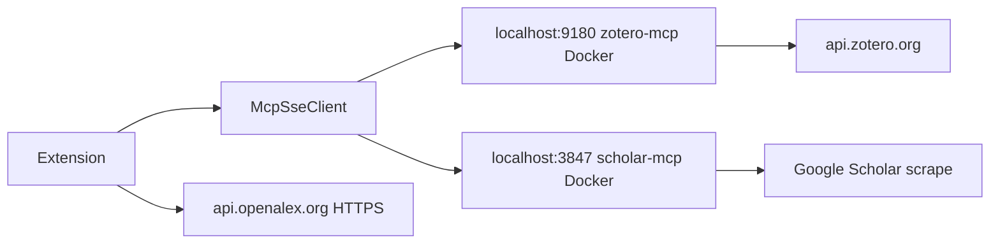
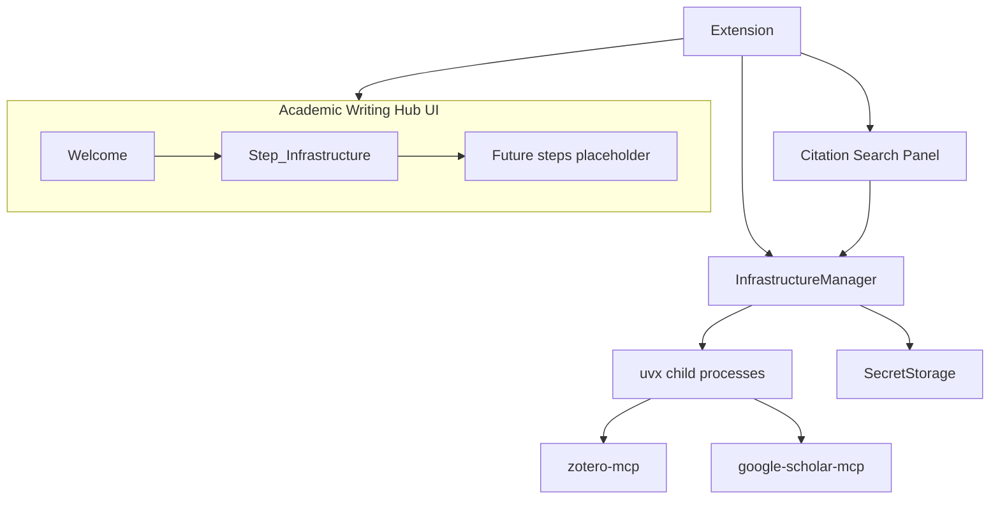

# План интеграции инфраструктуры в расширение

## Scope (что делаем / что откладываем)

**В scope:**
- Portable MCP (без Docker): zotero-mcp + google-scholar-mcp
- **Полноценный UI-хаб** для академического письма
- Развёртывание инфраструктуры как **шаг внутри UI**, не отдельная «тупая» команда
- OpenAlex остаётся встроенным HTTP-клиентом

**Вне scope (отложено намеренно):**
- `paper.yaml` / Makefile / scaffold paper-проекта
- template-aware onboarding
- PDF build / pandoc / make prerequisites UI
- Переработка IADE template integration

Существующий template-aware режим ([`projectDetector.js`](src/projectDetector.js)) **не трогаем** — он продолжит работать для текущих проектов, но новый UX на него не опирается.

---

## Текущее состояние

Расширение ([`src/extension.js`](src/extension.js)) — тонкий клиент к внешним SSE-серверам + отдельные webview для citation search ([`citationSearchPanel.js`](src/citationSearchPanel.js)).

**Целевая архитектура:**

---

## Фаза 1: Academic Writing Hub (UI-first)

**Главная идея:** пользователь открывает расширение и видит **guided experience**, а не набор разрозненных команд.

### Точка входа
- Activity bar view **«Academic Research»** → открывает Hub webview (не только TreeView со статусом)
- При первом запуске / незавершённой настройке — Hub открывается автоматически
- Команда палитры: `Academic Research: Open Writing Hub`

### Структура Hub (multi-step)

| Шаг | Содержание | Статус |
|---|---|---|
| **Welcome** | Что делает расширение, что понадобится (Zotero account, ~2 мин setup) | v1 |
| **Infrastructure** | Развёртывание MCP — см. Фаза 3 | v1 |
| **Writing** | Placeholder: «скоро» — ссылка на citation search, register | v1 stub |
| **Project** | Placeholder — без paper.yaml scaffold | отложено |

### UI-требования (не «топорно»)
- Один webview с **stepper** (прогресс 1/3), не цепочка `showInputBox`
- VS Code theme tokens (как в [`citationSearchPanel.js`](src/citationSearchPanel.js): `--vscode-*`)
- Inline validation, loading states, retry, copy-paste helpers
- `postMessage` протокол: `hubAction` / `hubState` / `hubProgress`
- Новый модуль: `src/writingHub/` (`writingHubPanel.js`, `writingHubHtml.js`, `writingHubState.js`)

### Что НЕ делаем в v1 UI
- Генерация `paper.yaml` и файлов проекта
- Wizard для Makefile / pandoc / LaTeX

---

## Фаза 2: Infrastructure Manager (backend для UI)

Модуль `src/infrastructure/`:

| Файл | Назначение |
|---|---|
| `prerequisiteChecker.js` | Python3, `uv`/`uvx`; guided install links |
| `processManager.js` | Spawn/kill/restart MCP, логи в Output Channel |
| `mcpRuntime.js` | `uvx zotero-mcp`, vendor `google-scholar-mcp` |
| `credentialStore.js` | API key в `SecretStorage`, library ID в settings |
| `healthMonitor.js` | `zotero_health`, scholar smoke test |
| `infrastructureManager.js` | Facade для Hub: `getState()`, `runSetup()`, `start()`, `stop()` |

**Запуск (portable):**
- **Zotero:** `uvx zotero-mcp --transport sse --port <dynamic>`
- **Scholar:** vendor в `vendor/google-scholar-mcp/` + `uv run`

**Транспорт:** сохранить [`McpSseClient`](src/mcpSseClient.js), динамические порты из manager. Clients ([`zoteroMcpClient.js`](src/zoteroMcpClient.js), [`scholarMcpClient.js`](src/scholarMcpClient.js)) берут endpoint из manager; `paper.yaml` mcp-секция — только legacy override.

`deactivate()` — остановка дочерних процессов.

---

## Фаза 3: Шаг «Infrastructure» в Hub

Не отдельная команда, а **экран внутри Hub**:

1. **Check environment** — Python / uv (авто-проверка при входе на шаг)
2. **Zotero account** — форма: API key + library ID; ссылка «как получить ключ»; optional auto-detect user ID
3. **Start services** — progress bar, лог последних строк
4. **Verify** — зелёные/красные чекмарки: Zotero search, Scholar search, OpenAlex ping
5. **Done** — кнопка «Continue to Writing» (stub) + «Open Citation Search»

Ошибки — human-readable с action buttons (Retry, Open Logs, Edit credentials).

Настройки [`package.json`](package.json):
- `academicResearch.mcpMode`: `bundled` | `external` (default: `bundled`)
- `academicResearch.setupComplete`: boolean (или derived from health)
- порты/host — для external mode
- секреты — только `SecretStorage`

---

## Фаза 4: Health & citation flow integration

- Status bar: краткий индикатор infra (`Ready` / `Setup needed` / `Degraded`)
- Hub sidebar badge на шаге Infrastructure если что-то сломалось
- Citation search ([`findCitationForSelection`](src/extension.js)): если infra не готова — предложить открыть Hub на шаге Infrastructure, не cryptic MCP error
- Degraded modes без изменений логики: OpenAlex + local bib если Zotero down

---

## Фаза 5: Опциональная интеграция с Cursor/VS Code MCP

Opt-in в конце шага Infrastructure:
- «Также подключить к AI-чату» → записать `.cursor/mcp.json` / workspace mcp config с текущими портами
- Расширение **само по себе** не зависит от Cursor MCP

---

## Фаза 6: Packaging & docs

- README: Install extension → Open Writing Hub → complete Infrastructure step
- Без Docker/systemd в quick start
- Тесты: `tests/infrastructure.test.js`, `tests/writingHub.test.js` (HTML render, state machine)
- `.vscodeignore`: vendor scholar-mcp only

---

## Порядок реализации

1. **Writing Hub UI shell** (welcome + stepper + placeholders) — чтобы сразу был правильный UX-каркас
2. **InfrastructureManager** backend
3. **Infrastructure step** в Hub (forms, progress, verify)
4. Подключить MCP clients к manager
5. Health integration + citation flow guards
6. Docs + tests

## Риски

- **Google Scholar MCP** — хрупкий; в UI помечать как «best-effort», OpenAlex — стабильный fallback
- **Python на машине пользователя** — `uv` recommended, fallback `pip`
- **UI scope creep** — жёстко не трогать paper/template до отдельного дизайн-раунда
